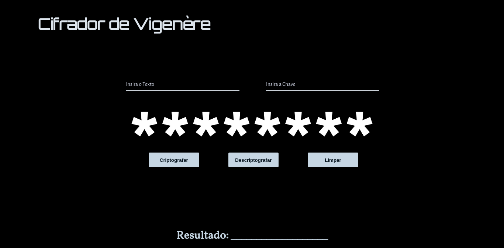

# Cifra-Vigenère

## Desenvolvido por:
- Juliandro Rocha Ribeiro

## Tecnologias Utilizadas:
- HTML
- CSS
- JavaScript

## Ferramentas Externas
- Google Fonts

## Imagens Externas
- Wallpaper (https://www.wired.com/2016/03/want-safer-passwords-dont-change-often/)

## Descrição

Página web para criptografar e descriptografar textos que utilizam a Cifra de Vigenère

